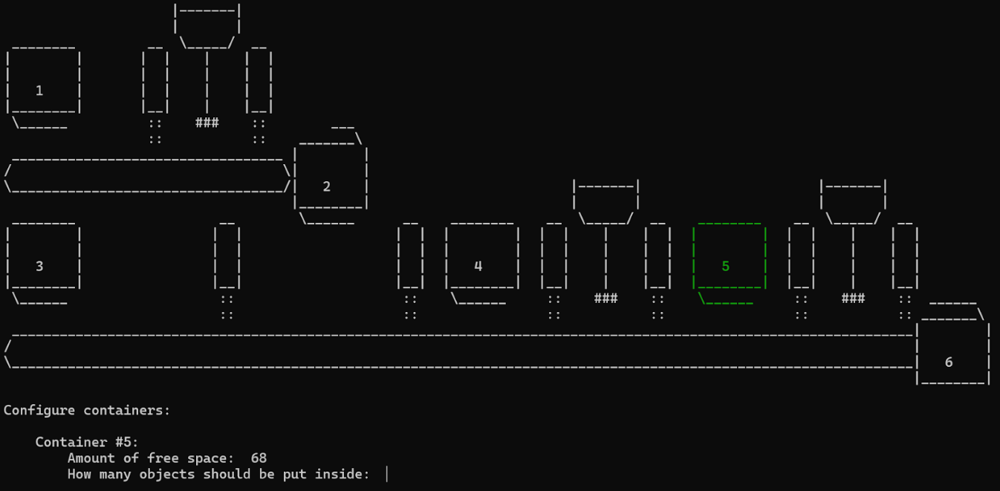
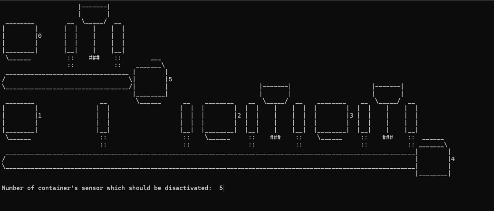
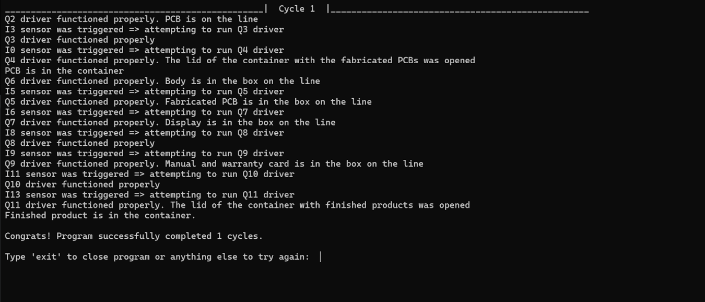

# Coursework
Курсовая работа 2024 по предмету "Технологии индустриального программирования"

В результате выполнения работы была реализована информационно-управляющая система управления производственным участком на языке С++. Программа имеет user-friendly интерфейс внутри консоли, позволяющий управлять производственным участком в двух режимах: auto и manual.

### Скриншоты демонстрирующие работоспособность программы:

